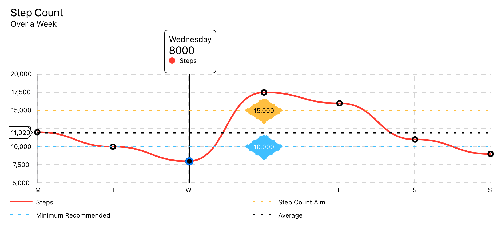
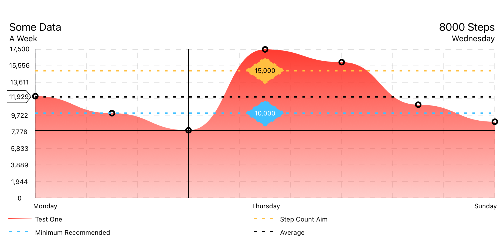
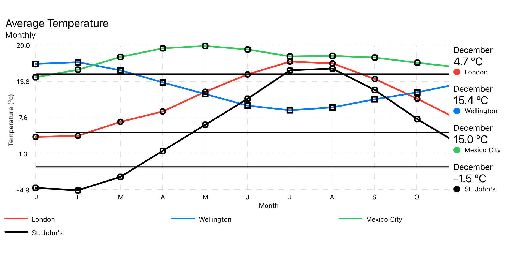
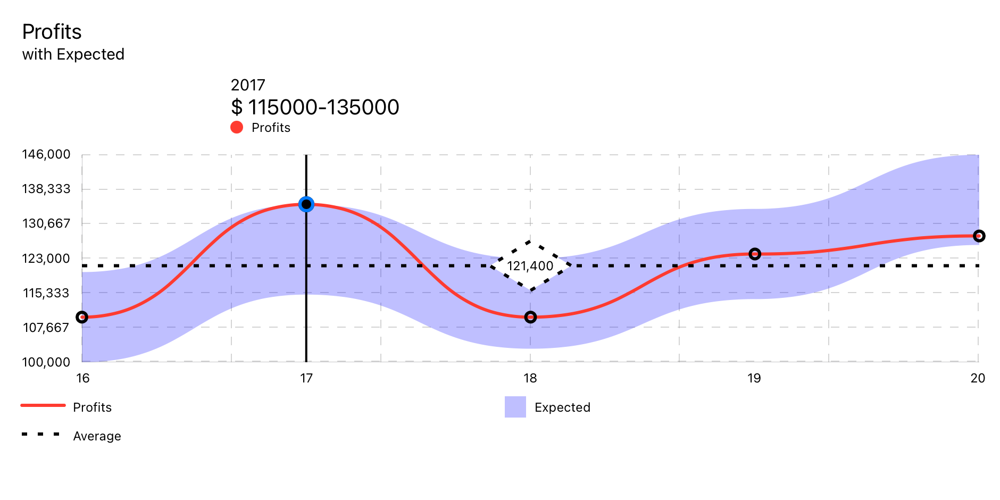
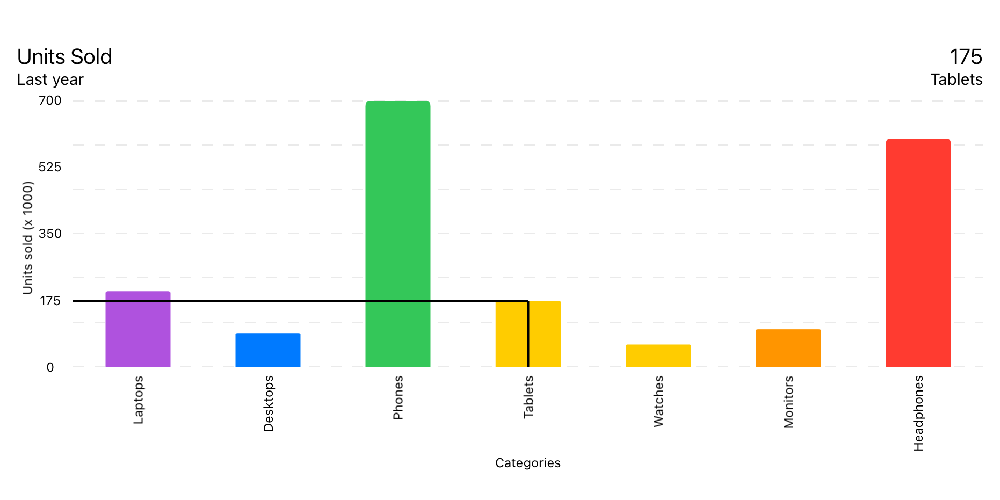
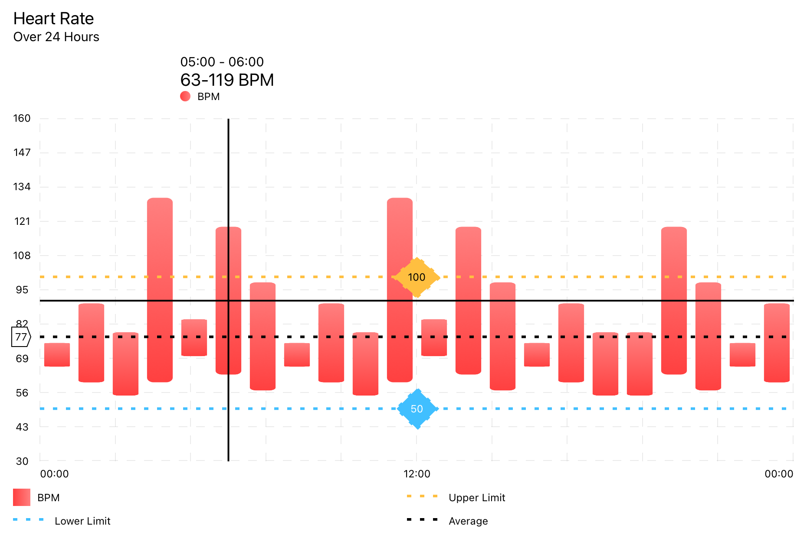
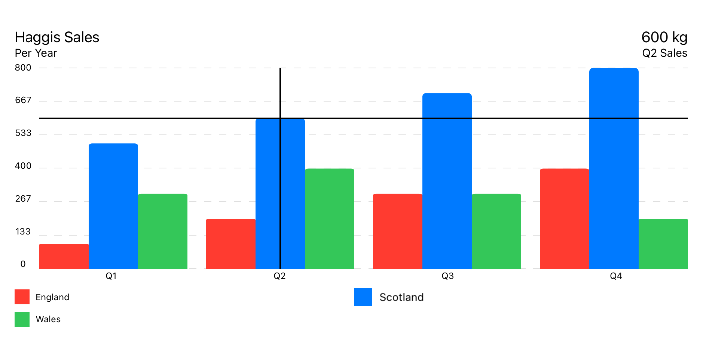
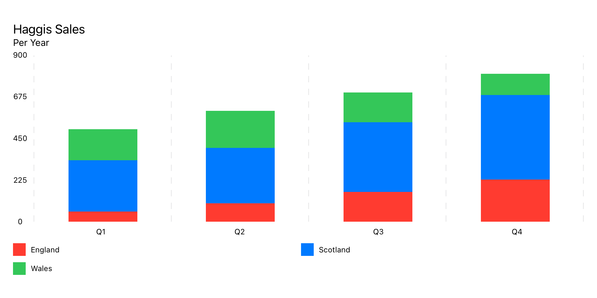
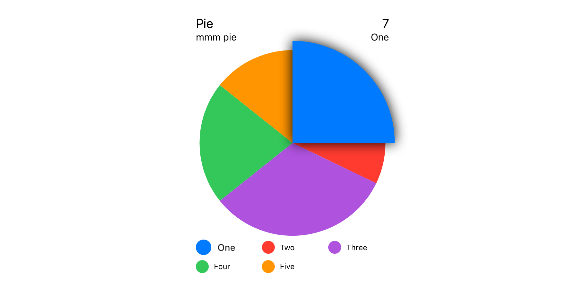
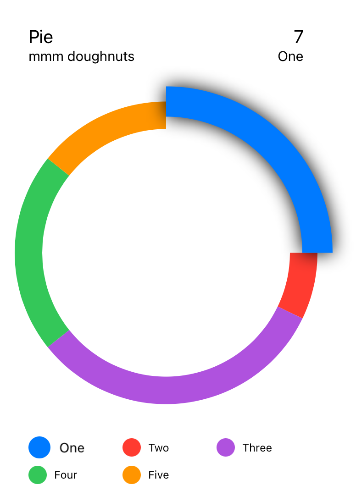

# SwiftUICharts

A charts / plotting library for SwiftUI. Works on macOS, iOS,  watchOS, and tvOS. Has accessibility features built in

[Demo Project](https://github.com/willdale/SwiftUICharts-Demo)

## Examples

### Line Charts

#### Line Chart


#### Filled Line Chart


#### Multi Line Chart


#### Ranged Line Chart



### Bar Charts

#### Bar Chart


#### Range Bar Chart


#### Grouped Bar Chart


#### Stacked Bar Chart



### Pie Charts

#### Pie Chart


#### Doughnut Chart



## Installation

Swift Package Manager

```
File > Swift Packages > Add Package Dependency...
```
```swift
import SwiftUICharts
```

## Documentation

## Chart Types

### LineChart

Uses `LineChartData` data model.

```
LineChart(chartData: data)
    .pointMarkers(chartData: data)
    .touchOverlay(chartData: data, specifier: "%.0f")
    .yAxisPOI(chartData: data,
              markerName: "Something",
              markerValue: 110,
              labelPosition: .center(specifier: "%.0f"),
              labelColour: Color.white,
              labelBackground: Color.blue,
              lineColour: Color.blue,
              strokeStyle: StrokeStyle(lineWidth: 3, dash: [5,10]))
    .averageLine(chartData: data,
                 strokeStyle: StrokeStyle(lineWidth: 3, dash: [5,10]))
    .xAxisGrid(chartData: data)
    .yAxisGrid(chartData: data)
    .xAxisLabels(chartData: data)
    .yAxisLabels(chartData: data)
    .infoBox(chartData: data)
    .floatingInfoBox(chartData: data)
    .headerBox(chartData: data)
    .legends(chartData: data, columns: [GridItem(.flexible()), GridItem(.flexible())])
```

---


## View Modifiers

[View Modifiers](#View-Modifiers) 
- [Touch Overlay](#Touch-Overlay)
- [Info Box](#Info-Box) 
- [Floating Info Box](#Floating-Info-Box) 
- [Header Box](#Header-Box) 
- [Legends](#Legends) 

- [Average Line](#Average-Line) 
- [Y Axis Point Of Interest](#Y-Axis-Point-Of-Interest) 
- [X Axis Grid](#X-Axis-Grid) 
- [Y Axis Grid](#Y-Axis-Grid) 
- [X Axis Labels](#X-Axis-Labels) 
- [Y Axis Labels](#Y-Axis-Labels) 

- [Point Markers](#Point-Markers) 

The order of the view modifiers is some what important as the modifiers are various types for stacks that wrap around the previous views.

### All Chart Types

#### Touch Overlay

Detects input either from touch of pointer. Finds the nearest data point and displays the relevent information where specified. 

The location of the info box is set in `ChartStyle -> infoBoxPlacement`.

```swift
.touchOverlay(chartData: CTChartData, specifier: String, unit: TouchUnit)
```
- chartData: Chart data model.
- specifier: Decimal precision for labels.
- unit: Unit to put before or after the value.

Setup within  Chart Data --> Chart Style


---


#### Info Box

Displays the information from [Touch Overlay](#Touch-Overlay) if `InfoBoxPlacement` is set to `.infoBox`.

The location of the info box is set in `ChartStyle -> infoBoxPlacement`.

```swift
.infoBox(chartData: CTChartData)
```
- chartData: Chart data model.


---


#### Floating Info Box

Displays the information from [Touch Overlay](#Touch-Overlay) if `InfoBoxPlacement` is set to `.floating`.

The location of the info box is set in `ChartStyle -> infoBoxPlacement`.

```swift
.floatingInfoBox(chartData: CTChartData)
```
- chartData: Chart data model.


---


#### Header Box

Displays the metadata about the chart, set in `Chart Data -> ChartMetadata`

Displays the information from [Touch Overlay](#Touch-Overlay) if `InfoBoxPlacement` is set to `.header`.

The location of the info box is set in `ChartStyle -> infoBoxPlacement`.

```swift
.headerBox(chartData: data)
```


---


#### Legends

Displays legends.

```swift
.legends()
```
Lays out markers over each of the data point.


---


### Line and Bar Charts

#### Average Line

Shows a marker line at the average of all the data points.

```swift
.averageLine(chartData: CTLineBarChartDataProtocol,
             markerName: "Average",
             labelPosition: .yAxis(specifier: "%.0f"),
             lineColour: .primary,
             strokeStyle: StrokeStyle(lineWidth: 3, dash: [5,10]))
```
- chartData: Chart data model.
- markerName: Title of marker, for the legend.
- labelPosition: Option to display the markers’ value inline with the marker.
- labelColour: Colour of the Text.
- labelBackground: Colour of the background.
- lineColour: Line Colour.
- strokeStyle: Style of Stroke.


---


#### Y Axis Point Of Interest

Configurable Point of interest

```swift
.yAxisPOI(chartData: CTLineBarChartDataProtocol,
          markerName: "Marker",
          markerValue: 123,
          labelPosition: .center(specifier: "%.0f"),
          labelColour: Color.black,
          labelBackground: Color.orange,
          lineColour: Color.orange,
          strokeStyle: StrokeStyle(lineWidth: 3, dash: [5,10]))
```
- chartData: Chart data model.
- markerName: Title of marker, for the legend.
- markerValue: Value to mark
- labelPosition: Option to display the markers’ value inline with the marker.
- labelColour: Colour of the Text.
- labelBackground: Colour of the background.
- lineColour: Line Colour.
- strokeStyle: Style of Stroke.
- Returns: A  new view containing the chart with a marker line at a specified value.


---


#### X Axis Grid

Adds vertical lines along the X axis.

```swift
.xAxisGrid(chartData: CTLineBarChartDataProtocol)
```
Setup within  `ChartData -> ChartStyle`.


---


#### Y Axis Grid

Adds horizontal lines along the Y axis.

```swift
.yAxisGrid(chartData: CTLineBarChartDataProtocol)
```
Setup within  `ChartData -> ChartStyle`.


---


#### X Axis Labels

Labels for the X axis.

```swift
.xAxisLabels(chartData: CTLineBarChartDataProtocol)
```
Setup within  `ChartData -> ChartStyle`.


---


#### Y Axis Labels

Automatically generated labels for the Y axis

```swift
.yAxisLabels(chartData: CTLineBarChartDataProtocol, specifier: "%.0f")
```
- specifier: Decimal precision specifier.

Setup within  `ChartData -> ChartStyle`.


---


### Line Charts

#### Point Markers

Lays out markers over each of the data point.

```swift
.pointMarkers(chartData: CTLineChartDataProtocol)
```
Setup within `Data Set -> PointStyle`.


---

## Examples

### Line Chart

```Swift
struct LineChartDemoView: View {
    
    let data : LineChartData = weekOfData()
    
    var body: some View {
        VStack {
            LineChart(chartData: data)
                .pointMarkers(chartData: data)
                .touchOverlay(chartData: data, specifier: "%.0f")
                .yAxisPOI(chartData: data,
                          markerName: "Step Count Aim",
                          markerValue: 15_000,
                          labelPosition: .center(specifier: "%.0f"),
                          labelColour: Color.black,
                          labelBackground: Color(red: 1.0, green: 0.75, blue: 0.25),
                          lineColour: Color(red: 1.0, green: 0.75, blue: 0.25),
                          strokeStyle: StrokeStyle(lineWidth: 3, dash: [5,10]))
                .yAxisPOI(chartData: data,
                          markerName: "Minimum Recommended",
                          markerValue: 10_000,
                          labelPosition: .center(specifier: "%.0f"),
                          labelColour: Color.white,
                          labelBackground: Color(red: 0.25, green: 0.75, blue: 1.0),
                          lineColour: Color(red: 0.25, green: 0.75, blue: 1.0),
                          strokeStyle: StrokeStyle(lineWidth: 3, dash: [5,10]))
                .averageLine(chartData: data,
                             strokeStyle: StrokeStyle(lineWidth: 3, dash: [5,10]))
                .xAxisGrid(chartData: data)
                .yAxisGrid(chartData: data)
                .xAxisLabels(chartData: data)
                .yAxisLabels(chartData: data)
                .infoBox(chartData: data)
                .headerBox(chartData: data)
                .legends(chartData: data, columns: [GridItem(.flexible()), GridItem(.flexible())])
                .frame(minWidth: 150, maxWidth: 900, minHeight: 150, idealHeight: 250, maxHeight: 400, alignment: .center)
        }
        .navigationTitle("Week of Data")
    }
    
    static func weekOfData() -> LineChartData {
        let data = LineDataSet(dataPoints: [
            LineChartDataPoint(value: 12000, xAxisLabel: "M", description: "Monday"),
            LineChartDataPoint(value: 10000, xAxisLabel: "T", description: "Tuesday"),
            LineChartDataPoint(value: 8000,  xAxisLabel: "W", description: "Wednesday"),
            LineChartDataPoint(value: 17500, xAxisLabel: "T", description: "Thursday"),
            LineChartDataPoint(value: 16000, xAxisLabel: "F", description: "Friday"),
            LineChartDataPoint(value: 11000, xAxisLabel: "S", description: "Saturday"),
            LineChartDataPoint(value: 9000,  xAxisLabel: "S", description: "Sunday")
        ],
        legendTitle: "Steps",
        pointStyle: PointStyle(),
        style: LineStyle(lineColour: ColourStyle(colour: .red), lineType: .curvedLine))
        
        let metadata   = ChartMetadata(title: "Step Count", subtitle: "Over a Week")
        
        let gridStyle  = GridStyle(numberOfLines: 7,
                                   lineColour   : Color(.lightGray).opacity(0.5),
                                   lineWidth    : 1,
                                   dash         : [8],
                                   dashPhase    : 0)
        
        let chartStyle = LineChartStyle(infoBoxPlacement    : .infoBox(isStatic: false),
                                        infoBoxBorderColour : Color.primary,
                                        infoBoxBorderStyle  : StrokeStyle(lineWidth: 1),
                                        
                                        markerType          : .vertical(attachment: .line(dot: .style(DotStyle()))),
                                        
                                        xAxisGridStyle      : gridStyle,
                                        xAxisLabelPosition  : .bottom,
                                        xAxisLabelColour    : Color.primary,
                                        xAxisLabelsFrom     : .dataPoint(rotation: .degrees(0)),
                                        
                                        yAxisGridStyle      : gridStyle,
                                        yAxisLabelPosition  : .leading,
                                        yAxisLabelColour    : Color.primary,
                                        yAxisNumberOfLabels : 7,
                                        
                                        baseline            : .minimumWithMaximum(of: 5000),
                                        topLine             : .maximum(of: 20000),
                                        
                                        globalAnimation     : .easeOut(duration: 1))
        
        return LineChartData(dataSets       : data,
                             metadata       : metadata,
                             chartStyle     : chartStyle)
        
    }
}
```


---
