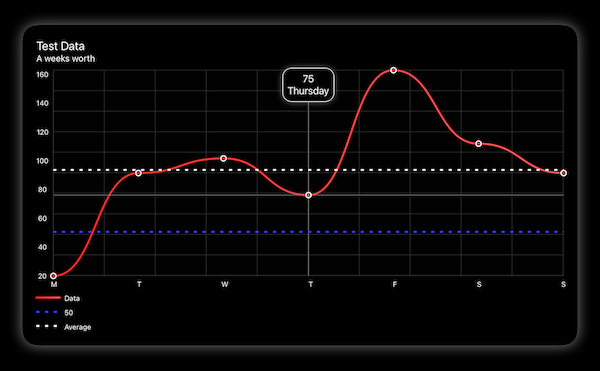
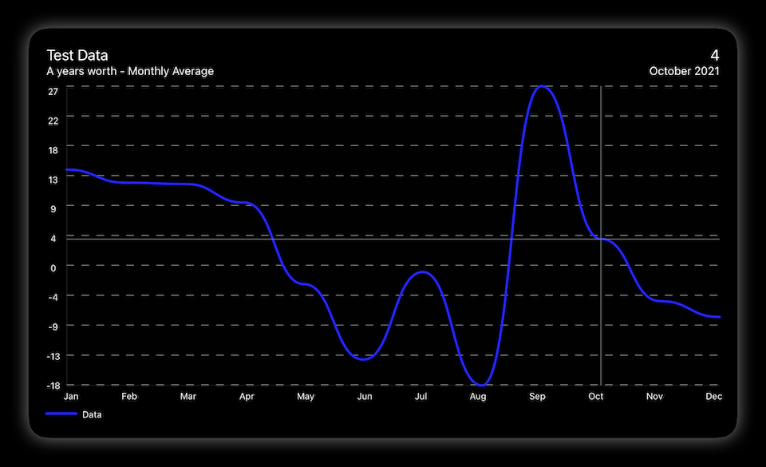
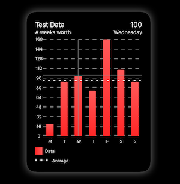
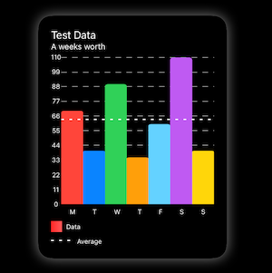

# SwiftUICharts

A charts / plotting library for SwiftUI. Works on macOS and iOS. Support for tvOS, and watchOS hopfully soon.

[Demo Project](https://github.com/willdale/SwiftUICharts-Demo)

## Examples

### Line Chart



#### View
```swift
LineChart()
    .touchOverlay()
    .pointMarkers()
    .averageLine(strokeStyle: StrokeStyle(lineWidth: 3, dash: [5,10]))
    .yAxisPOI(markerName: "50", markerValue: 50, lineColour: Color(red: 0.25, green: 0.25, blue: 1.0), strokeStyle: StrokeStyle(lineWidth: 3, dash: [5,10]))
    .xAxisGrid()
    .yAxisGrid()
    .xAxisLabels()
    .yAxisLabels()
    .headerBox()
    .legends()
    .environmentObject(data)
```

#### Data Model

```swift
static func weekOfData() -> ChartData {
    
    let data : [ChartDataPoint] = [
        ChartDataPoint(value: 20,  xAxisLabel: "M", pointLabel: "Monday"),
        ChartDataPoint(value: 90,  xAxisLabel: "T", pointLabel: "Tuesday"),
        ChartDataPoint(value: 100, xAxisLabel: "W", pointLabel: "Wednesday"),
        ChartDataPoint(value: 75,  xAxisLabel: "T", pointLabel: "Thursday"),
        ChartDataPoint(value: 160, xAxisLabel: "F", pointLabel: "Friday"),
        ChartDataPoint(value: 110, xAxisLabel: "S", pointLabel: "Saturday"),
        ChartDataPoint(value: 90,  xAxisLabel: "S", pointLabel: "Sunday")
    ]
    
    let metadata   : ChartMetadata  = ChartMetadata(title       : "Test Data",
                                                    subtitle    : "A weeks worth",
                                                    lineLegend  : "Data")
    
    let labels      : [String]      = ["Mon", "Thu", "Sun"]

    let gridStyle   : GridStyle     = GridStyle(lineColour  : Color(.lightGray).opacity(0.25),
                                                lineWidth   : 1,
                                                dash: [CGFloat]())
    
    let chartStyle  : ChartStyle    = ChartStyle(infoBoxPlacement: .floating,
                                                 xAxisGridStyle  : gridStyle,
                                                 yAxisGridStyle  : gridStyle,
                                                 xAxisLabels     : XAxisLabelSetup(labelPosition : .bottom,
                                                                                   labelsFrom    : .xAxisLabel),
                                                 yAxisLabels     : YAxisLabelSetup(labelPosition : .leading,
                                                                              numberOfLabels: 7))
    
    let lineStyle   : LineStyle     = LineStyle(colours     : [Color(red: 1.0, green: 0.15, blue: 0.15), Color(red: 1.0, green: 0.35, blue: 0.35)],
                                                startPoint  : .leading,
                                                endPoint    : .trailing,
                                                lineType    : .curvedLine,
                                                strokeStyle : StrokeStyle(lineWidth: 3,
                                                                          lineCap: .round,
                                                                          lineJoin: .round))
    
    let pointStyle : PointStyle     = PointStyle(pointSize: 9, borderColour: Color.primary, lineWidth: 2, pointType: .outline, pointShape: .circle)
    
    return ChartData(dataPoints     : data,
                     metadata       : metadata,
                     xAxisLabels    : labels,
                     chartStyle     : chartStyle,
                     lineStyle      : lineStyle,
                     pointStyle     : pointStyle
    )
}

```




#### View


```swift
LineChart()
    .touchOverlay(specifier: "%.2f")
    .yAxisGrid()
    .xAxisLabels()
    .yAxisLabels()
    .headerBox()
    .legends()
    .environmentObject(data)
```

#### Data Model

```swift
static func yearOfDataMonthlyAverage() -> ChartData {
    
    var data : [ChartDataPoint] = []
    let calendar = Calendar.current
    let date = Date()
    
    for index in 1...365 {
        let value: Double = Double(Int.random(in: -100...100))
        let date = calendar.date(byAdding: .day, value: index, to: date)
        data.append(ChartDataPoint(value: value, date: date))
    }
    
    let metadata   : ChartMetadata  = ChartMetadata(title       : "Test Data",
                                                    subtitle    : "A years worth - Monthly Average",
                                                    lineLegend  : "Data")
    
    let labels      : [String]      = ["Jan", "Feb", "Mar", "Apr", "May", "Jun", "Jul", "Aug", "Sep", "Oct", "Nov", "Dec"]
    
    let chartStyle  : ChartStyle    = ChartStyle(infoBoxPlacement: .header,
                                                 yAxisGridStyle: GridStyle(lineColour: Color.primary.opacity(0.5)))
    
    let lineStyle   : LineStyle     = LineStyle(colour: Color(red: 0.15, green: 0.15, blue: 1.0),
                                                lineType: .curvedLine,
                                                strokeStyle: StrokeStyle(lineWidth: 3,
                                                                         lineCap: .round,
                                                                         lineJoin: .round))
    
    return ChartData(dataPoints     : data,
                     metadata       : metadata,
                     xAxisLabels    : labels,
                     chartStyle     : chartStyle,
                     lineStyle      : lineStyle,
                     calculations   : .averageMonth)
}
```


### Bar Chart




#### View

```swift
BarChart()
    .touchOverlay()
    .averageLine(markerName: "Average", lineColour: Color.primary, strokeStyle: StrokeStyle(lineWidth: 2, dash: [5, 10]))
    .yAxisGrid()
    .xAxisLabels()
    .yAxisLabels()
    .headerBox()
    .legends()
    .environmentObject(data)
```

#### Data Model

```swift
static func weekOfData() -> ChartData {
    
    let data : [ChartDataPoint] = [
        ChartDataPoint(value: 20,  xAxisLabel: "M", pointLabel: "Monday"),
        ChartDataPoint(value: 90,  xAxisLabel: "T", pointLabel: "Tuesday"),
        ChartDataPoint(value: 100, xAxisLabel: "W", pointLabel: "Wednesday"),
        ChartDataPoint(value: 75,  xAxisLabel: "T", pointLabel: "Thursday"),
        ChartDataPoint(value: 160, xAxisLabel: "F", pointLabel: "Friday"),
        ChartDataPoint(value: 110, xAxisLabel: "S", pointLabel: "Saturday"),
        ChartDataPoint(value: 90,  xAxisLabel: "S", pointLabel: "Sunday")
    ]
    
    let metadata   : ChartMetadata  = ChartMetadata(title       : "Test Data",
                                                    subtitle    : "A weeks worth",
                                                    lineLegend  : "Data")
            
    let gridStyle   : GridStyle     = GridStyle(lineColour  : Color(.lightGray),
                                                lineWidth   : 1)
    
    let chartStyle  : ChartStyle    = ChartStyle(infoBoxPlacement: .header,
                                                 xAxisGridStyle  : gridStyle,
                                                 yAxisGridStyle  : gridStyle)
    
    let barStyle    : BarStyle      = BarStyle(barWidth: 0.5,
                                               colourFrom: .barStyle,
                                               colours: [Color(red: 1.0, green: 0.15, blue: 0.15),
                                                         Color(red: 1.0, green: 0.35, blue: 0.35)],
                                               startPoint: .bottom,
                                               endPoint: .top)
    
    return ChartData(dataPoints     : data,
                     metadata       : metadata,
                     chartStyle     : chartStyle,
                     barStyle       : barStyle)
}

```




#### View


```swift
BarChart()
    .touchOverlay()
    .averageLine(markerName: "Average", lineColour: Color.primary, strokeStyle: StrokeStyle(lineWidth: 2, dash: [5, 10]))
    .yAxisGrid()
    .xAxisLabels()
    .yAxisLabels()
    .headerBox()
    .legends()
    .environmentObject(data)
```

#### Data Model

```swift
static func weekOfData() -> ChartData {
    
    let data : [ChartDataPoint] = [
        ChartDataPoint(value: 70,  xAxisLabel: "M", pointLabel: "Monday"   , colour: Color(.systemRed)),
        ChartDataPoint(value: 40,  xAxisLabel: "T", pointLabel: "Tuesday"  , colour: Color(.systemBlue)),
        ChartDataPoint(value: 90, xAxisLabel:  "W", pointLabel: "Wednesday", colour: Color(.systemGreen)),
        ChartDataPoint(value: 35,  xAxisLabel: "T", pointLabel: "Thursday" , colour: Color(.systemOrange)),
        ChartDataPoint(value: 60, xAxisLabel:  "F", pointLabel: "Friday"   , colour: Color(.systemTeal)),
        ChartDataPoint(value: 110, xAxisLabel: "S", pointLabel: "Saturday" , colour: Color(.systemPurple)),
        ChartDataPoint(value: 40,  xAxisLabel: "S", pointLabel: "Sunday"   , colour: Color(.systemYellow))
    ]
    
    let metadata   : ChartMetadata  = ChartMetadata(title       : "Test Data",
                                                    subtitle    : "A weeks worth",
                                                    lineLegend  : "Data")
    
    
    let gridStyle   : GridStyle     = GridStyle(lineColour  : Color(.lightGray),
                                                lineWidth   : 1)
    
    let chartStyle  : ChartStyle    = ChartStyle(infoBoxPlacement: .header,
                                                 xAxisGridStyle  : gridStyle,
                                                 yAxisGridStyle  : gridStyle)
    
    let barStyle    : BarStyle      = BarStyle(barWidth: 1,
                                               colourFrom: .dataPoints,
                                               colours: [Color(red: 1.0, green: 0.15, blue: 0.15),
                                                         Color(red: 1.0, green: 0.35, blue: 0.35)],
                                               startPoint: .bottom,
                                               endPoint: .top)
    
    return ChartData(dataPoints     : data,
                     metadata       : metadata,
                     chartStyle     : chartStyle,
                     barStyle       : barStyle
    )
}
```


## Documentation

All data and most styling is passed into the view by an Environment Object. See [ChartData](#ChartData).

```swift
.environmentObject(data)
```

[View Modifiers](#View-Modifiers) 
- [Touch Overlay](#Touch-Overlay) 
- [Point Markers](#Point-Markers) 
- [Average Line](#Average-Line) 
- [Y Axis Point Of Interest](#Y-Axis-Point-Of-Interest) 
- [X Axis Grid](#X-Axis-Grid) 
- [Y Axis Grid](#Y-Axis-Grid) 
- [X Axis Labels](#X-Axis-Labels) 
- [Y Axis Labels](#Y-Axis-Labels) 
- [Header Box](#Header-Box) 
- [Legends](#Legends) 

[Data Models](#Data-Models) 
- [Chart Data](#ChartData) 
- [Chart Data Point](#ChartDataPoint) 
- [Chart Metadata](#ChartMetadata)
- [Chart Style](#ChartStyle) 
    - [Grid Style](#GridStyle) 
    - [XAxisLabelSetup](#XAxisLabelSetup) 
    - [YAxisLabelSetup](#YAxisLabelSetup) 
- [Line Style](#LineStyle) 
- [Bar Style](#BarStyle) 
- [Point Style](#PointStyle) 

## View Modifiers

### Touch Overlay

Detects input either from touch of pointer. Finds the nearest data point and displays the relevent information.

The location of the info box is set in [ChartStyle](#ChartStyle).

```swift
.touchOverlay(specifier: String)
```
- specifier: Decimal precision for labels

Setup within  [ChartData](#ChartData) --> [ChartStyle](#ChartStyle) 

### Point Markers

Lays out markers over each of the data point.

```swift
.pointMarkers()
```
Setup within  [ChartData](#ChartData) --> [PointStyle](#PointStyle) 


### Average Line

Shows a marker line at the average of all the data points.

```swift
.averageLine(markerName     : String        = "Average",
             lineColour     : Color         = Color.primary,
             strokeStyle    : StrokeStyle   = StrokeStyle(lineWidth: 2,
                                                          lineCap: .round,
                                                          lineJoin: .round,
                                                          miterLimit: 10,
                                                          dash: [CGFloat](),
                                                          dashPhase: 0)
```
- markerName: Title of marker, for the legend
- lineColour: Line Colour
- strokeStyle: Style of Stroke


### Y Axis Point Of Interest

Configurable Point of interest

```swift
.yAxisPOI(markerName        : String        = "Average",
             lineColour     : Color         = Color.primary,
             strokeStyle    : StrokeStyle   = StrokeStyle(lineWidth: 2,
                                                          lineCap: .round,
                                                          lineJoin: .round,
                                                          miterLimit: 10,
                                                          dash: [CGFloat](),
                                                          dashPhase: 0)
```
- markerName: Title of marker, for the legend
- markerValue : Chosen point.
- lineColour: Line Colour
- strokeStyle: Style of Stroke


### X Axis Grid

Adds vertical lines along the X axis.

```swift
.xAxisGrid()
```
Setup within  [ChartData](#ChartData) --> [ChartStyle](#ChartStyle)  --> [GridStyle](#GridStyle).


### Y Axis Grid

Adds horizontal lines along the Y axis.

```swift
.yAxisGrid()
```
Setup within  [ChartData](#ChartData) --> [ChartStyle](#ChartStyle)  --> [GridStyle](#GridStyle).


### X Axis Labels

Labels for the X axis.

```swift
.xAxisLabels()
```
Setup within  [ChartData](#ChartData) --> [ChartStyle](#ChartStyle)  --> [XAxisLabelSetup](#XAxisLabelSetup) 

### Y Axis Labels

Automatically generated labels for the Y axis

```swift
.yAxisLabels(specifier : String = "%.0f")
```
- specifier: Decimal precision specifier.

Setup within  [ChartData](#ChartData) --> [ChartStyle](#ChartStyle)  --> [YAxisLabelSetup](#YAxisLabelSetup) 


### Header Box

Displays the metadata about the chart. See [ChartMetadata](#ChartMetadata) 

```swift
.headerBox()
```


### Legends

Legends from the data being show on the chart (See [ChartMetadata](#ChartMetadata) ) and any markers (See [Average Line](#Average-Line)  and [Y Axis Point Of Interest](#Y-Axis-Point-Of-Interest)). 

```swift
.legends()
```
Lays out markers over each of the data point.


## Data Models

### ChartData

The ChartData type is where the majority of the configuration is done. The only required initialiser is dataPoints.

```swift
ChartData(dataPoints    : [ChartDataPoint],
          metadata      : ChartMetadata?,
          xAxisLabels   : [String]?,
          chartStyle    : ChartStyle,
          lineStyle     : LineStyle,
          barStyle      : BarStyle,
          pointStyle    : PointStyle,
          calculations  : CalculationType)
```
- dataPoints: Array of ChartDataPoints. See [ChartDataPoint](#ChartDataPoint).
- metadata: Data to fill in the metadata box above the chart. See [ChartMetadata](#ChartMetadata).
- xAxisLabels: Array of Strings for when there are too many data points to show all xAxisLabels.
- chartStyle : The parameters for the aesthetic of the chart. See [ChartStyle](#ChartStyle).
- lineStyle: The parameters for the aesthetic of the line chart.  See [LineChartStyle](#LineLineChartStyle).
- barStyle: The parameters for the aesthetic of the bar chart. See [BarStyle](#BarStyle).
- pointStyle: The parameters for the aesthetic of the data point markers.  See [PointStyle](#PointStyle).
- calculations: Choose whether to perform calculations on the data points. If so, then by what means.


### ChartDataPoint

ChartDataPoint holds the information for each of the individual data points.

Colours are only used in Bar Charts.

__All__
```swift
ChartDataPoint(value: Double,
               xAxisLabel: String?,
               pointLabel: String?,
               date: Date?
               ...)
```
- value: Value of the data point.
- xAxisLabel: Label that can be shown on the X axis.
- pointLabel: A longer label that can be shown on touch input.
- date: Date of the data point if any data based calculations are required.

__Single Colour__
```swift
ChartDataPoint(...
               colour: Color)
          
```
- colour: Colour for use with a bar chart.

__Colour Gradient__
```swift
ChartDataPoint(...
               colours     : [Color]?,
               startPoint  : UnitPoint?,
               endPoint    : UnitPoint?)
```
- colours: Colours for Gradient
- startPoint: Start point for Gradient
- endPoint: End point for Gradient

__Colour Gradient with stop control__
```swift
ChartDataPoint(...
               stops: [GradientStop],
               startPoint: UnitPoint?,
               endPoint: UnitPoint?)
               
```
- stops: Colours and Stops for Gradient with stop control.
- startPoint: Start point for Gradient.
- endPoint: End point for Gradient.


### ChartMetadata

Data model for the chart's metadata

```swift
ChartMetadata(title: String?,
              subtitle: String?,
              lineLegend: String?)
```
- title: The charts Title
- subtitle: The charts subtitle
- lineLegend: The title for the legend


### ChartStyle

Model for controlling the overall aesthetic of the chart.

```swift
ChartStyle(infoBoxPlacement : InfoBoxPlacement,
           xAxisGridStyle   : GridStyle,
           yAxisGridStyle   : GridStyle,
           xAxisLabels      : XAxisLabelSetup,
           yAxisLabels      : YAxisLabelSetup)
```
- infoBoxPlacement: Placement of the information box that appears on touch input.
- xAxisGridStyle: Style of the vertical lines breaking up the chart. See [GridStyle](#GridStyle).
- yAxisGridStyle: Style of the horizontal lines breaking up the chart. See [GridStyle](#GridStyle).
- xAxisLabels: Style of the labels on the X axis.
- yAxisLabels: Style of the labels on the Y axis.


### GridStyle

Model for controlling the look of the Grid

```swift
GridStyle(numberOfLines : Int,
          lineColour    : Color,
          lineWidth     : CGFloat,
          dash          : [CGFloat],
          dashPhase     : CGFloat)
```
- numberOfLines: Number of lines to break up the axis
- lineColour: Line Colour
- lineWidth: Line Width
- dash: Dash
- dashPhase: Dash Phase


### XAxisLabelSetup

Model for the styling of the labels on the X axis.

```swift
XAxisLabelSetup(labelPosition: XAxisLabelPosistion,
                labelsFrom: LabelsFrom)
```
- labelPosition: Location of the X axis labels - Top or Bottom
- labelsFrom: Where the label data come from. DataPoint or xAxisLabels


### YAxisLabelSetup

Model for the styling of the labels on the Y axis.

```swift
YAxisLabelSetup(labelPosition   : YAxisLabelPosistion,
                numberOfLabels  : Int)
```
- labelPosition: Location of the Y axis labels - Leading or Trailing
- numberOfLabels: Number Of Labels on Y Axis


### LineStyle

Model for controlling the overall aesthetic of the line chart.

There are three possible initialisers: Single Colour, Colour Gradient or Colour Gradient with stop control.

__Single Colour__
```swift
LineChartStyle(colour: Color,
          ...
```
- colour: Single Colour

__Colour Gradient__
```swift
LineChartStyle(colours: [Color]?,
               startPoint: UnitPoint?,
               endPoint: UnitPoint?,
               ...
```
- colours: Colours for Gradient
- startPoint: Start point for Gradient
- endPoint: End point for Gradient

__Colour Gradient with stop control__
```swift
LineChartStyle(stops: [GradientStop],
               startPoint: UnitPoint?,
               endPoint: UnitPoint?,
               ...
```
- stops: Colours and Stops for Gradient with stop control.
- startPoint: Start point for Gradient.
- endPoint: End point for Gradient.

__All__
```swift
LineChartStyle(...
               strokeStyle : StrokeStyle,
               ignoreZero: Bool)
```
- lineType: Drawing style of the line.
- strokeStyle: Stroke Style
- ignoreZero: Whether the chart should skip data points who's value is 0 while keeping the spacing.


### BarStyle

Model for controlling the aesthetic of the bar chart.

There are three possible initialisers: Single Colour, Colour Gradient or Colour Gradient with stop control.

__All__
```swift
BarStyle(barWidth       : CGFloat,
         cornerRadius   : CornerRadius,
         colourFrom     : ColourFrom,
         ...)
```
- barWidth: How much of the available width to use. 0...1
- cornerRadius: Corner radius of the bar shape.
- colourFrom: Where to get the colour data from.

__Single Colour__
```swift
BarStyle(...
         colour: Single Colour)    
```
- colour: Single Colour

__Colour Gradient__
```swift
BarStyle(...
         colours     : [Color]  
         startPoint  : UnitPoint
         endPoint    : UnitPoint)
```
- colours: Colours for Gradient
- startPoint: Start point for Gradient
- endPoint: End point for Gradient

__Colour Gradient with stop control__
```swift
BarStyle(...
         stops       : [GradientStop]
         startPoint  : UnitPoint
         endPoint    : UnitPoint)
```
- stops: Colours and Stops for Gradient with stop control.
- startPoint: Start point for Gradient.
- endPoint: End point for Gradient.


### PointStyle

Model for controlling the aesthetic of the point markers.

```swift
PointStyle(pointSize    : CGFloat,
           borderColour : Color,
           fillColour   : Color,
           lineWidth    : CGFloat,
           pointType    : PointType,
           pointShape   : PointShape)
```
- pointSize: Overall size of the mark
- borderColour: Outter ring colour
- fillColour: Center fill colour
- lineWidth: Outter ring line width
- pointType: Style of the point marks.
- pointShape: Shape of the points
